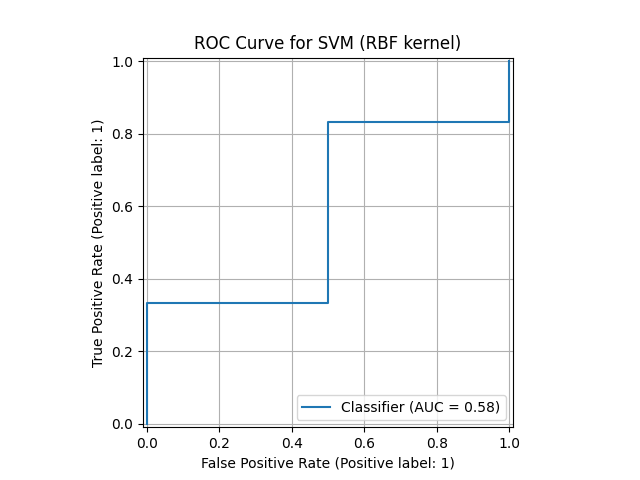
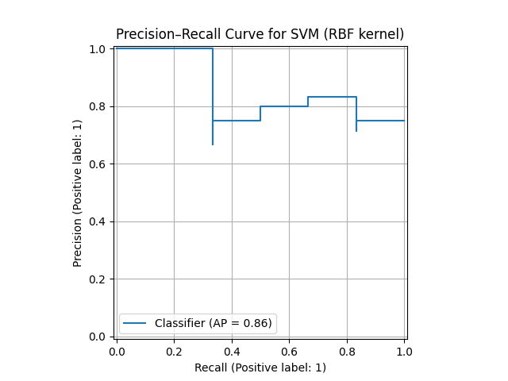

# <center>Hypertrophic Cardiomyopathy Detection — Model Evaluation

## 🔎 Overview
The goal of this project was to develop a classical machine learning model that can distinguish between **healthy hearts** and **those affected by cardiomegaly** (hypertrophic cardiomyopathy).  
The dataset contained geometric and imaging-based features, such as **heart and lung width**, **heart and lung area**, **CTR ratio**, **Inscribed circle radius** and **inertia tensors**.

Data preprocessing included:
- splitting into train/test sets (80/20),
- feature scaling using `StandardScaler` (standardization).

I trained and tested several classical ML algorithms:
- K-Nearest Neighbors (KNN)
- Decision Tree
- Support Vector Machine (SVM)
- Logistic Regression
- Random Forest

Each model was evaluated using **cross-validation** and tested on the unseen dataset.  
Metrics used: **Accuracy, Precision, Recall, and F1-score**.

---

## ⚙️ Models and Results

| Model | Cross-val Mean | Test Accuracy | Precision | Recall | F1-score |
|--------|----------------|----------------|------------|---------|-----------|
| **KNN** | 0.824 | 0.625 | 0.714 | 0.833 | 0.769 |
| **Decision Tree** | 0.786 | 0.625 | 0.714 | 0.833 | 0.769 |
| **SVM** | **0.866** | **0.750** | 0.750 | **1.000** | **0.857** |
| **Logistic Regression** | 0.760 | 0.750 | **0.833** | 0.833 | 0.833 |
| **Random Forest** | 0.864 | 0.625 | 0.714 | 0.833 | 0.769 |

---

## 🏆 Selected Model: **Support Vector Machine (SVM)**

### Justification
I choosed the **SVM classifier** because it achieved:
- the **highest mean cross-validation score (0.866)**,
- the **highest Recall (1.0)**, ensuring no diseased samples were missed,
- the **highest cross-validation mean (0.75)**, together with Logistic Regression,
- a strong **F1-score (0.857)**, indicating a balanced performance.

This makes SVM the most suitable choice for medical classification tasks, where **minimizing false negatives** is critical.

---

## 📈 Evaluation Plots

Example ROC and Precision-Recall (PR) curves can be generated using:

```python
from sklearn.metrics import RocCurveDisplay, PrecisionRecallDisplay, roc_auc_score
import matplotlib.pyplot as plt

pipe_svc.fit(X_train, y_train)
y_pred = pipe_svc.predict(X_test)
y_pred_attempt = pipe_svc.decision_function(X_test)

roc_display = RocCurveDisplay.from_predictions(y_test, y_pred_attempt)
plt.title("ROC Curve for SVM (RBF kernel)")
plt.grid(True)
plt.show()

pr_display = PrecisionRecallDisplay.from_predictions(y_test, y_pred_attempt)
plt.title("Precision–Recall Curve for SVM (RBF kernel)")
plt.grid(True)
plt.show()

roc_auc = roc_auc_score(y_test, y_pred_proba)
print(f"Area Under ROC Curve (AUC): {roc_auc:.3f}") 
```
<br>

